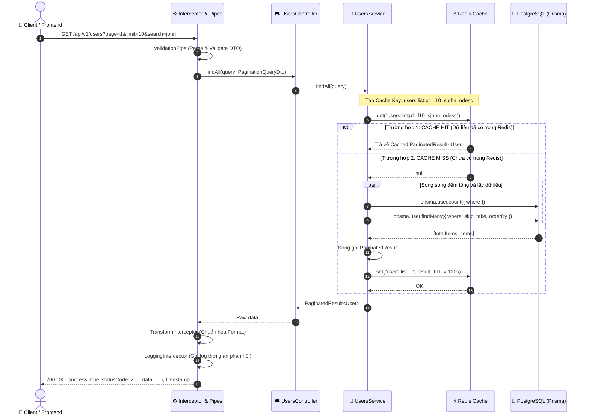
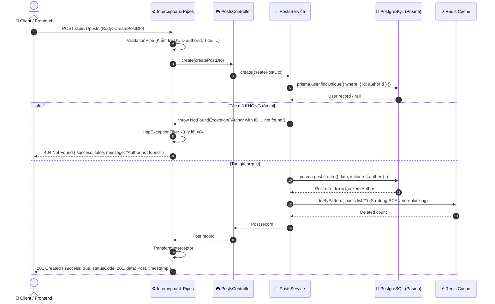
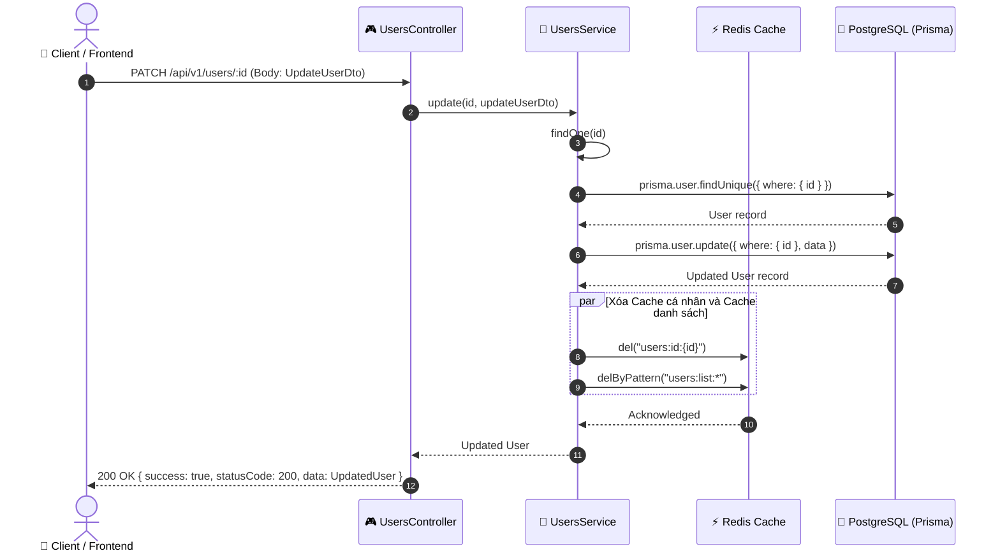
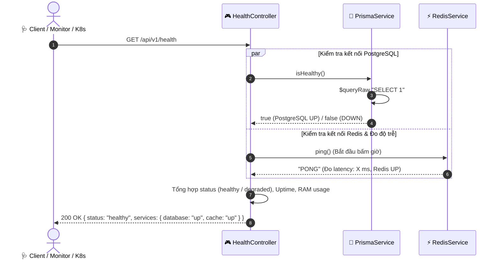

# 📑 Tài Liệu Hệ Thống: Danh Sách API, Class Diagram & Sequence Diagram

Dự án: **NestJS Enterprise Backend Template**  
Công nghệ: **NestJS 11 + PostgreSQL 16 + Prisma ORM 7 + Redis 7 Cache + Swagger**  
Base URL: `http://localhost:3000/api/v1`  
Swagger UI: `http://localhost:3000/api/docs`

---

## 1. 🌐 Danh Sách Toàn Bộ Các API Đang Sử Dụng (API Reference)

Tất cả các response trả về đều được chuẩn hóa qua `TransformInterceptor` theo định dạng:
```json
{
  "success": true,
  "statusCode": 200,
  "data": { ... },
  "timestamp": "2026-08-17T14:30:00.000Z"
}
```

---

### 1.1. Root & System Diagnostics

| STT | Phương thức | Endpoint | Chức năng | Caching & Ghi chú |
| :---: | :---: | :--- | :--- | :--- |
| 1 | `GET` | `/` hoặc `/api/v1` | Lấy thông tin cơ bản về API (version, name, docs link) | Trực tiếp từ Service |
| 2 | `GET` | `/api/v1/health` | Kiểm tra trạng thái kết nối PostgreSQL & Redis, memory, uptime | Đo ping Redis + Query raw PostgreSQL |

#### Chi tiết Endpoint Health:
- **Query / Body**: Không có
- **Response mẫu (200 OK)**:
  ```json
  {
    "status": "healthy",
    "timestamp": "2026-08-17T14:30:00.000Z",
    "uptime": 1245.67,
    "environment": "development",
    "memoryUsage": { "rss": "85MB", "heapUsed": "42MB" },
    "services": {
      "database": { "type": "PostgreSQL", "status": "up" },
      "cache": { "type": "Redis", "status": "up", "latency": "2ms" }
    }
  }
  ```

---

### 1.2. Quản Lý Người Dùng (Users API - `/api/v1/users`)

| STT | Phương thức | Endpoint | Chức năng | Request / Query | Cache Strategy |
| :---: | :---: | :--- | :--- | :--- | :--- |
| 3 | `POST` | `/api/v1/users` | Tạo mới một người dùng | Body: `CreateUserDto` | Xóa cache `users:list:*` |
| 4 | `GET` | `/api/v1/users` | Lấy danh sách người dùng phân trang & tìm kiếm | Query: `PaginationQueryDto` | Cache Redis `120s` (Key: `users:list:p{page}_l{limit}_s{search}_o{order}`) |
| 5 | `GET` | `/api/v1/users/stats` | Thống kê số lượng users, posts, tỉ lệ trung bình | Không | Cache Redis `300s` (Key: `users:stats`) |
| 6 | `GET` | `/api/v1/users/:id` | Xem chi tiết người dùng kèm danh sách bài viết | Param: `id` (UUID) | Cache Redis `600s` (Key: `users:id:{id}`) |
| 7 | `PATCH` | `/api/v1/users/:id` | Cập nhật thông tin người dùng | Param: `id`, Body: `UpdateUserDto` | Xóa `users:id:{id}` & `users:list:*` |
| 8 | `DELETE` | `/api/v1/users/:id` | Xóa người dùng (Cascade xóa bài viết liên quan) | Param: `id` (UUID) | Xóa `users:id:{id}` & `users:list:*` |

#### Chi tiết DTOs Module Users:
- **`CreateUserDto`**:
  - `email` *(string, required, isEmail)*: Email duy nhất của người dùng.
  - `name` *(string, optional)*: Tên hiển thị.
  - `password` *(string, optional, min 6 ký tự)*: Mật khẩu.
  - `role` *(string, optional, default "USER")*: Phân quyền người dùng.
- **`UpdateUserDto`**: Kế thừa `PartialType(CreateUserDto)`.
- **`PaginationQueryDto`**:
  - `page` *(number, default: 1)*
  - `limit` *(number, default: 10, max: 100)*
  - `search` *(string, tìm kiếm không phân biệt hoa thường trên `email` và `name`)*
  - `order` *(enum: `asc` \| `desc`, default: `desc` theo `createdAt`)*

---

### 1.3. Quản Lý Bài Viết (Posts API - `/api/v1/posts`)

| STT | Phương thức | Endpoint | Chức năng | Request / Query | Cache Strategy |
| :---: | :---: | :--- | :--- | :--- | :--- |
| 9 | `POST` | `/api/v1/posts` | Tạo mới bài viết gắn với tác giả | Body: `CreatePostDto` | Xóa cache `posts:list:*` |
| 10 | `GET` | `/api/v1/posts` | Danh sách bài viết phân trang kèm tác giả | Query: `PaginationQueryDto` | Cache Redis `120s` (Key: `posts:list:...`) |
| 11 | `GET` | `/api/v1/posts/:id` | Chi tiết bài viết kèm thông tin tác giả | Param: `id` (UUID) | Cache Redis `600s` (Key: `posts:id:{id}`) |
| 12 | `PATCH` | `/api/v1/posts/:id` | Cập nhật bài viết | Param: `id`, Body: `UpdatePostDto` | Xóa `posts:id:{id}` & `posts:list:*` |
| 13 | `DELETE` | `/api/v1/posts/:id` | Xóa bài viết | Param: `id` (UUID) | Xóa `posts:id:{id}` & `posts:list:*` |

#### Chi tiết DTOs Module Posts:
- **`CreatePostDto`**:
  - `title` *(string, required)*: Tiêu đề bài viết.
  - `content` *(string, optional)*: Nội dung chi tiết.
  - `published` *(boolean, optional, default false)*: Trạng thái xuất bản.
  - `authorId` *(string UUID, required)*: ID của người dùng làm tác giả.
- **`UpdatePostDto`**: Kế thừa `PartialType(CreatePostDto)`.

---

## 2. 🏛️ Class Diagram (Sơ đồ Lớp Hệ Thống)

Sơ đồ thể hiện cấu trúc phân tầng (Controller -> Service -> Data Access/Redis), DTOs, Filters, Interceptors và Quan hệ thực thể (Prisma Models).

```mermaid
classDiagram
    direction TB

    %% Global / Presentation Layer
    class AppController {
        -appService: AppService
        +getInfo(): object
    }

    class HealthController {
        -prisma: PrismaService
        -redis: RedisService
        +check(): Promise~HealthStatus~
    }

    class UsersController {
        -usersService: UsersService
        +create(createUserDto: CreateUserDto): Promise~User~
        +findAll(query: PaginationQueryDto): Promise~PaginatedResult~User~~
        +getStats(): Promise~UserStats~
        +findOne(id: string): Promise~User~
        +update(id: string, updateUserDto: UpdateUserDto): Promise~User~
        +remove(id: string): Promise~DeleteResult~
    }

    class PostsController {
        -postsService: PostsService
        +create(createPostDto: CreatePostDto): Promise~Post~
        +findAll(query: PaginationQueryDto): Promise~PaginatedResult~Post~~
        +findOne(id: string): Promise~Post~
        +update(id: string, updatePostDto: UpdatePostDto): Promise~Post~
        +remove(id: string): Promise~DeleteResult~
    }

    %% Service Layer
    class AppService {
        +getInfo(): object
    }

    class UsersService {
        -prisma: PrismaService
        -redis: RedisService
        -CACHE_PREFIX: string
        +create(createUserDto: CreateUserDto): Promise~User~
        +findAll(query: PaginationQueryDto): Promise~PaginatedResult~User~~
        +findOne(id: string): Promise~User~
        +update(id: string, updateUserDto: UpdateUserDto): Promise~User~
        +remove(id: string): Promise~DeleteResult~
        +getStats(): Promise~UserStats~
    }

    class PostsService {
        -prisma: PrismaService
        -redis: RedisService
        -CACHE_PREFIX: string
        +create(createPostDto: CreatePostDto): Promise~Post~
        +findAll(query: PaginationQueryDto): Promise~PaginatedResult~Post~~
        +findOne(id: string): Promise~Post~
        +update(id: string, updatePostDto: UpdatePostDto): Promise~Post~
        +remove(id: string): Promise~DeleteResult~
    }

    %% Infrastructure Layer
    class PrismaService {
        -pool: pg.Pool
        +onModuleInit(): Promise~void~
        +onModuleDestroy(): Promise~void~
        +isHealthy(): Promise~boolean~
    }

    class RedisService {
        -client: Redis
        -defaultTtl: number
        +onModuleInit(): Promise~void~
        +onModuleDestroy(): Promise~void~
        +getClient(): Redis
        +ping(): Promise~string~
        +get~T~(key: string): Promise~T | null~
        +set(key: string, value: any, ttlInSeconds?: number): Promise~void~
        +del(key: string | string[]): Promise~void~
        +delByPattern(pattern: string): Promise~number~
        +exists(key: string): Promise~boolean~
        +expire(key: string, ttlInSeconds: number): Promise~boolean~
        +ttl(key: string): Promise~number~
        +getOrSet~T~(key: string, fallbackFn: Function, ttlInSeconds?: number): Promise~T~
    }

    %% Data Models (Prisma)
    class User {
        +String id
        +String email
        +String name
        +String password
        +String role
        +Boolean isActive
        +DateTime createdAt
        +DateTime updatedAt
        +Post[] posts
    }

    class Post {
        +String id
        +String title
        +String content
        +Boolean published
        +String authorId
        +DateTime createdAt
        +DateTime updatedAt
        +User author
    }

    %% DTOs
    class CreateUserDto {
        +String email
        +String name
        +String password
        +String role
    }

    class UpdateUserDto {
        +String email
        +String name
        +String password
        +String role
    }

    class CreatePostDto {
        +String title
        +String content
        +Boolean published
        +String authorId
    }

    class UpdatePostDto {
        +String title
        +String content
        +Boolean published
        +String authorId
    }

    class PaginationQueryDto {
        +number page
        +number limit
        +string search
        +string order
        +skip: number
        +take: number
    }

    %% Interceptors & Filters
    class TransformInterceptor {
        +intercept(context: ExecutionContext, next: CallHandler): Observable
    }

    class LoggingInterceptor {
        +intercept(context: ExecutionContext, next: CallHandler): Observable
    }

    class HttpExceptionFilter {
        +catch(exception: HttpException, host: ArgumentsHost): void
    }

    class PrismaClientExceptionFilter {
        +catch(exception: PrismaClientKnownRequestError, host: ArgumentsHost): void
    }

    %% Relationships
    AppController --> AppService
    HealthController --> PrismaService
    HealthController --> RedisService

    UsersController --> UsersService
    UsersController ..> CreateUserDto
    UsersController ..> UpdateUserDto
    UsersController ..> PaginationQueryDto

    PostsController --> PostsService
    PostsController ..> CreatePostDto
    PostsController ..> UpdatePostDto
    PostsController ..> PaginationQueryDto

    UsersService --> PrismaService
    UsersService --> RedisService
    UsersService ..> User

    PostsService --> PrismaService
    PostsService --> RedisService
    PostsService ..> Post

    User "1" *-- "0..*" Post : has many
```



---

## 3. 🔄 Sequence Diagrams (Sơ đồ Tuần Tự)

### 3.1. Sequence Diagram 1: Luồng truy vấn dữ liệu với Cache-Aside (GET `/api/v1/users`)

Minh họa cơ chế kiểm tra Cache tại Redis:
- **Cache Hit**: Trả ngay dữ liệu từ RAM Redis.
- **Cache Miss**: Truy vấn PostgreSQL qua Prisma, lưu ngược lại vào Redis với TTL `120s`, sau đó trả về cho Client.



---

### 3.2. Sequence Diagram 2: Luồng tạo mới bài viết & Xóa Cache (POST `/api/v1/posts`)

Minh họa quy trình kiểm tra quan hệ ràng buộc (Author ID), ghi vào Database và vô hiệu hóa cache danh sách (Cache Invalidation).



---

### 3.3. Sequence Diagram 3: Luồng Cập Nhật / Xóa Người Dùng (PATCH / DELETE `/api/v1/users/:id`)

Minh họa cơ chế evict cả cache chi tiết của User lẫn cache danh sách người dùng.



---

### 3.4. Sequence Diagram 4: Luồng Kiểm Tra Sức Khỏe Hệ Thống (GET `/api/v1/health`)

Minh họa cơ chế giám sát thời gian thực đối với PostgreSQL Database và Redis Server.



---

## 4. 📌 Tóm Tắt Chiến Lược Caching & Quy Tắc Quản Lý Dữ Liệu

1. **Cache Pattern**: Cache-Aside (Lazy Loading).
2. **TTL (Time to Live)**:
   - Danh sách Users / Posts: `120 giây` (2 phút).
   - Chi tiết từng bản ghi User / Post theo ID: `600 giây` (10 phút).
   - Thống kê (User Stats): `300 giây` (5 phút).
3. **Invalidation Policy**:
   - Khi có thao tác Ghi (`POST`, `PATCH`, `DELETE`), tự động xóa toàn bộ key danh sách tương ứng (`users:list:*` hoặc `posts:list:*`) thông qua cơ chế Redis `SCAN` an toàn (non-blocking).
   - Khi `PATCH` hoặc `DELETE` theo ID, xóa đồng thời cache chi tiết `users:id:{id}`.
